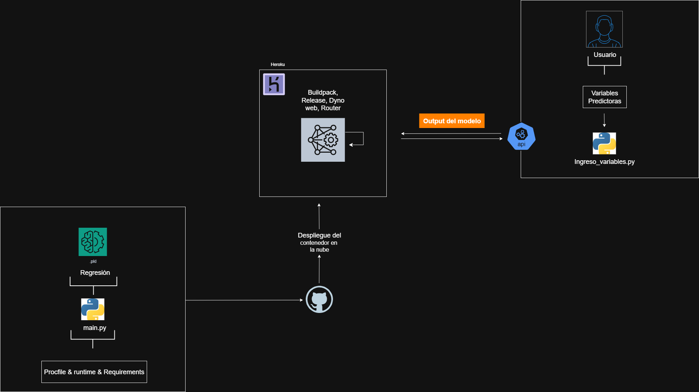

<H1>Trabajo Electivo MLOPS</H1>

Integrantes:

<li>Cristián González</li>
<li>Hector González</li>

<H2>Contexto</H2>

El sigueinte trabajo tiene por objetivo publicar a traves de una IP publica un modelo de ML para la predicción de recuperacion de cobre para el proceso rougher. La forma de ejecutarlo es: A través del archivo "ingreso_variables.py" se conecta por API a Heroku y consumo los archivos "main.py" y el archivo "RandomForestReg_GS.pkl". El link a Heroku es "https://mlops-copper-688b09eaaf1b.herokuapp.com/".

  

 

